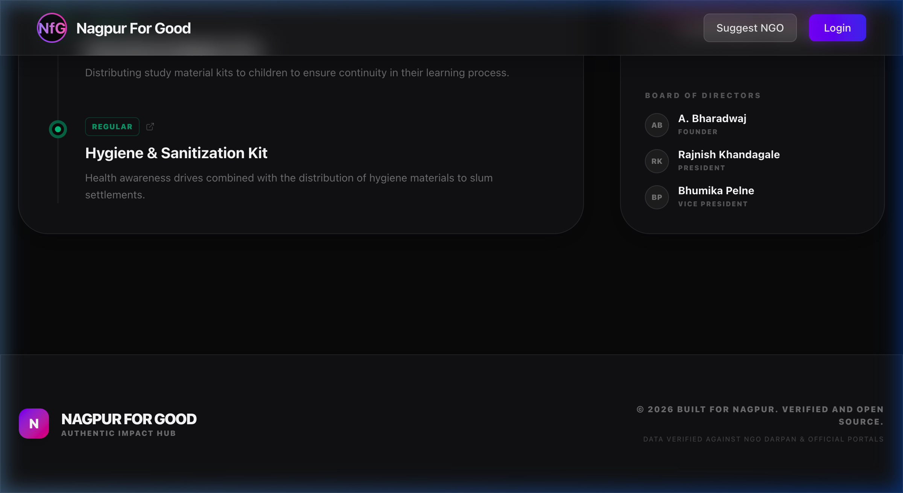

# 🛸 Nagpur For Good

**Connect. Support. Transform Nagpur.**

Nagpur For Good is a high-fidelity, transparent information portal designed to bridge the gap between intent and authentic local impact. We provide a curated, source-verified directory of NGOs in Nagpur, enabling users to discover, support, and track real-world change.

---

## 🎨 Premium UI/UX Experience

Built with a modern **Glassmorphism** aesthetic, the platform offers a premium, immersive experience that emphasizes data clarity and visual excellence.

### 🏠 Intelligent Discovery
Filter NGOs by cause—Education, Healthcare, Environment, and more—with an interactive, responsive grid.


### 🏙️ Deep-Dive Organization Portals
Every NGO has a dedicated space featuring their mission, detailed programs, and verified leadership.


---

## 🛡️ Absolute Data Integrity (Primary Sourcing)

We enforce a strict **Primary Source Only** policy. All impact benchmarks and milestones are linked directly to the organizations' official digital assets.

### 🔗 Transparency Hub
- **Click-to-Source**: Every benchmark is a live redirect to official records.
- **Verified Metrics**: Data on 127,600+ Langar meals and 198,000+ lives impacted cross-referenced with official portals.
- **Zero Third-Party Aggregators**: We bypass middleman data for 100% authenticity.


### 👥 Verified Leadership
Transparent board of directors and team sections, ensuring horizontal accountability and trust.



---

## 🚀 Tech Stack

- **Frontend**: React 18 + Vite
- **Routing**: React Router 7
- **Styling**: TailwindCSS 4 (Premium Glassmorphism System)
- **Icons**: Lucide React
- **Animations**: Tailwind Animate + Framer-inspired transitions

---

## 🛠️ Development

### Setup
```bash
npm install
```

### Run Locally
```bash
npm run dev
```

### Build
```bash
npm run build
```

---
> [!IMPORTANT]
> This platform is a verified information hub. All data is cross-referenced against NGO Darpan and official organization portals.
